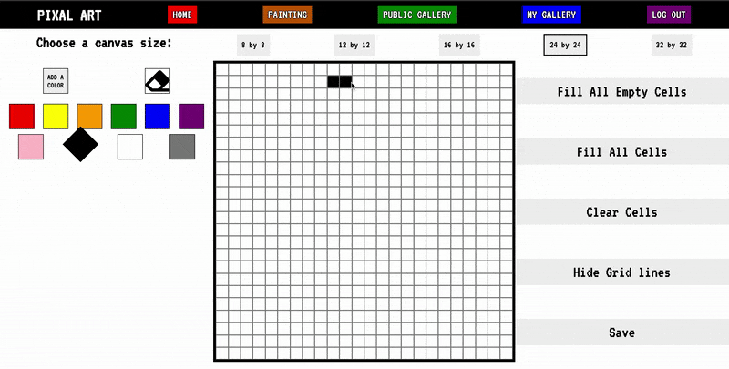

# Pixal Art

Draw you favorite Retro Pixal Art.

## Draw at [https://pixal-art.herokuapp.com/](https://pixal-art.herokuapp.com/)

## About Pixal Art

This is a pixel art drawing app. Choose from 5 different canvas sizes to draw wonderful pixel art. Each canvas is a square and the larger the canvas size the smaller the pixels will appear to be. You can choose from one of ten basic colors to start drawing or add a new color to your paint pallette. You can click a single pixel to color it or click and drag to color several in a row.

There are also some overall actions you can take like filling all the empty pixels with your choosen color, filling all the cells a single color.

To start over simply click clear cells or choose a new canvas size.

Besides drawing your can view artwork created and saved in the Public Gallery. Or log in to see past artwork that you created and saved in your gallery.

Currently saving is restricted to logged in users only. And the images will be saved to your Gallery. When saving you will be given the options to make your artwork viewable by the public or private to you.

## To View Locally

Clone Repo.

Then, run `npm install` to install all node modules.

Create a database named "pixalArt" by running `createdb` from your command line so it exists (and can be connected to).

Finally you can run `npm run server:dev` to start the web server.

In a second terminal navigate back to the local repo and run `npm run client:dev` to start the react server.

The express server is setup to run as a proxy on localhost: 5000, while react-scripts servers up the fontend code on localhost:3000. Both need to be up and running for the app to work.

In addition to `client:dev` and `server:dev`, you have access to `db:build` which (you will write to) rebuilds the database, all the tables, and ensures that there is meaningful data present. There is initial seeding data that can be added to your database by running `npm run db:build`.
